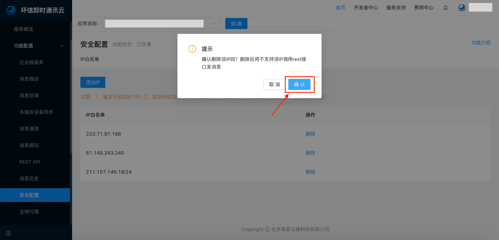

# 开通配置环信即时通讯 IM 服务

<Toc />

## 前提条件

配置环信即时通讯 IM 服务前，请确保已经具备以下条件：

- 创建一个环信开发者账号。

## 创建应用

参照以下步骤在环信即时通讯云控制台创建应用和购买即时通讯 IM 服务。

1. 登录环信即时通讯云控制台，进入首页，点击 **添加应用** 按钮，创建即时通讯 IM 应用。

2. 在 **创建应用** 窗口中，输入创建应用所需要的信息，点击 **创建** 按钮，创建应用。新建应用的服务版本默认为免费版。

3. 创建应用时，需要选择数据中心所在的位置。

## 购买服务

1. 创建应用后，在 **应用列表** 中点击所创建应用后的 **查看** 按钮，进入 **应用设置** 页面。

2. 通过左侧的导航栏，进入 **即时通讯** > **功能配置** > **版本开通**，选择需要的版本，可以在页面查看不同套餐的区别。

3. 找到目标应用后点击查看，进入服务概览页，单击 **升级版本**，即进入即时通讯 IM 服务版本购买页。

4. 根据业务实际需求选择所需的服务版本和可选增值服务。

配置参数说明：

| 参数项                   | 说明                                          |
| :----------------------- | :-------------------------------------------- |
| 选择要开通套餐的 App Key | 请确认 App Key 是否选择正确，购买后无法修改。 |
| 选择套服务版本           |  当 App Key 为免费版时，可购买专业版、旗舰版或尊享版，不可单独购买增值服务。 当 App Key 为专业版时，可购买旗舰版、尊享版或单独购买增值服务。 当 App Key 为旗舰版时，可购买尊享版或单独购买增值服务。 当 App Key 为尊享版时，仅支持单独购买增值服务。|
| 可选增值服务 | 请根据实际需求选择增值功能，包含单个群成员数上限、单个用户可加入群组数上限、消息云存储时长以及 REST API 接口调用频率上限等。 |

:::notice
服务购买页显示的预估费用仅用于做参考，预估费用仅包含基础费用，具体费用以每月账单为准。
:::

1. 勾选 **我已阅读并同意 《环信云服务购买协议》**。

2. 核对所选服务信息，单击 **立即购买**，即生成订单。

购买成功后即刻生效，当天开始计费；每月 5 号自动扣除上月总消耗费用。

## 获取环信即时通讯 IM 的信息

在环信通讯云控制台可以获取使用即时通讯 IM 服务所需的必要信息。

- `OrgName`: 环信账号的唯一标识，`OrgName` 是 `AppKey` 的一部分；
- `AppName`: 应用的唯一标识，`AppName` 是 `AppKey` 的一部分；
- `AppKey`： 应用的唯一标识，由 `OrgName` 和 `AppName` 组成，生成后不允许修改；
- `host`：API 请求域名，环信即时通讯 IM 为应用提供的 REST API 和 WebSocket 的请求域名；
- 数据中心：环信 IM 提供的分布在全球的多个数据中心，包括：

| 类型         | 名称                                            |
| :----------- | :---------------------------------------------- |
| 国内数据中心 | - 北京 1 区， 中国 - 北京 Vip6 区，中国         |
| 海外数据中心 | - 新加坡 1 区 - 法兰克福，德国 - 弗吉尼亚，美国 |

## 查看和配置服务

创建应用后，参照以下步骤在环信通讯云控制台查看信息和配置环信即时通讯 IM 服务。

找到目标 App Key 单击 **查看**，在左侧导航栏选择 **即时通讯** > **功能配置** > **功能配置总览**，您可以查看到当前 App Key 的服务配置并根据实际业务需求管理相关配置。

#### 操作说明

1. 免费开通：指该功能当前服务版本里已包含，可根据实际业务需求选择是否开通；点击 **免费开通**，则可立即开通该功能；
2. 设置：指该功能已开通且有需要设置的配置项，点击 **设置**，即可进入对应设置页配置；
3. 升级：功能如果当前服务版本中不包含、或需要提高功能状态中的参数值，则可点击 **升级**，购买升级至符合业务需求的服务版本即可；
4. 增值服务：增值功能包含单个群成员数上限（不可叠加）、单个用户可加入群组数上限（不可叠加）、消息云存储时长（可叠加）以及 REST API接口调用频率上限（可叠加），点击增值服务，即进入增值服务购买页，请根据实际需求选择。

#### 增值服务购买说明

消息云存储时长和 REST API 接口调用频率上限支持可叠加购买，即支持多倍购买；以消息云存储时长举例说明，如购买时选择了 10 份，则表示消息云存储时长延长 300 天（30 天*10）；

单个群成员数上限和单个用户可加入群组数上限不支持叠加购买；以单个群成员数上限举例说明，如果旗舰版购买了 8000 人/群的增值服务，则表示单个群成员上限配置提升至 8000 人/群。

## 消息撤回（REST & 客户端）设置

1. 在功能配置总览页，搜索找到消息撤回（REST & 客户端），单击右侧的 **设置**（已开通状态下）。
2. 在弹出的消息撤回时间设置对话框中，设置消息可撤回时长，可分别设置端消息撤回时长和 REST 消息撤回时长。
3. 单击 **确定** 保存配置。

## 配置推送证书

使用离线推送通知之前，需完成各平台的证书配置。当前支持以下平台：苹果 APNs、谷歌 FCM、华为、小米、OPPO、VIVO 和魅族。

开启环信即时通讯 IM 服务后，按照以下步骤添加消息推送证书：

1. 在环信即时通讯云控制台的应用列表中，找到开启了 IM 服务的项目，点击 **查看**。

2. 在左侧导航栏，依次点击 **即时通讯** > **功能配置** > **消息推送**，进入 **推送配置** 页面。

3. 点击 **添加推送证书** 按钮，打开 **推送配置** 窗口。

4. 在 **推送配置** 窗口中，填写各厂商平台的相关推送信息，点击 **保存** 按钮，完成证书配置。

## 消息回调配置

环信即时通讯 IM 提供消息回调的服务。配置回调后，应用服务器会收到所选类型的消息和事件。

购买环信即时通讯 IM 服务后，按照以下步骤添加消息回调证书：

1. 在环信即时通讯云控制台的应用列表中，找到开启了 IM 服务的项目，点击 **查看**。

2. 在左侧导航栏，依次点击 **即时通讯** > **功能配置** > **消息回调**，进入 **推送回调** 页面。

3. 点击 **添加回调地址** 按钮，打开 **回调配置** 窗口。

4. 在 **回调配置** 窗口中，填写回调相关配置信息，点击 **保存** 按钮，完成回调配置，具体配置内容说明见 [回调配置](/document/server-side/callback.html#实现步骤)。

## 敏感词设置

1. 在功能配置总览页，搜索找到敏感词，单击右侧的 **设置**（已开通状态下），前往敏感词配置页。
2. 在敏感词配置页，单击 **编辑**，在弹出的敏感词服务对话框中，按需求选择对应设置。

单击 **确定** 保存配置。

## Rest-IP 白名单设置

### 添加 IP 白名单

1. 在功能配置总览页，搜索找到 **REST-IP 白名单**，单击右侧的 **设置**（已开通状态下），前往安全配置页。
2. 在安全配置页，单击 **添加 IP**，在弹出的添加 IP 对话框中，填写 IP 信息。
3. 单击 **保存** 完成配置。

### 删除 IP 白名单

如果您不再允许某个 IP 继续发 REST 消息，可以在 IP 白名单中执行删除操作。如果您删除 IP 白名单中所有 IP，当白名单列表为空时，则默认所有 IP 均可发 REST 消息。

1. 点击导航：**即时通讯** > **功能配置** > **安全配置**

2. 在 **IP白名单** 列表中，单击目标 IP 右侧的 **删除**

1. 单击 **确认**，则删除完毕。

## 账户中心

登录环信后台 ，点击 **费用中心** > **账户中心**，即可查看当前账户余额和支出明细。

## 查看订单记录

登录环信后台 ，点击 **费用中心** > **订单中心**，即可查看当前所有的订单记录。

**订单状态说明：**

- 开通中：用户生成订单后，会需要 3-5 分钟完成功能配置，此时订单会显示为开通中状态，表示购买的服务还在配置中；当配置完成后，订单会变为服务中状态；
- 服务中：表示当前订单中购买的服务在使用中；同一 App Key 在同一时刻下，仅能有至多 1 个服务版本订单处于使用中状态；
- 已完结：表示当前订单中购买的服务已关闭；当客户升级新服务后，原服务版本订单和相关增值服务订单均会自动关闭变为已完结状态。

点击 **详情**，即可查看订单详情页。

## 查看账单记录

登录环信后台 ，点击 **费用中心** > **消费账单**，即可查看当前已生成的账单记录。

